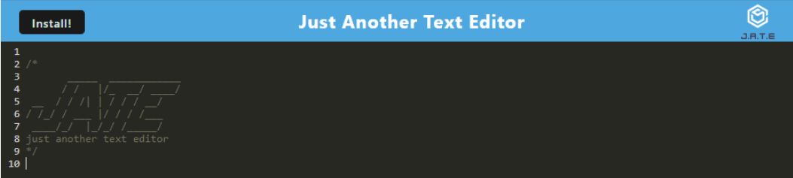

# PWA - Text Editor

## Description
A text editor that runs in the browser. The app will be a single-page application that meets the PWA criteria. Additionally, it will feature a number of data persistence techniques that serve as redundancy in case one of the options is not supported by the browser. The application will also function offline.


## Deployed
[Heroku]() 

## Installation

```
npm i
```

## Usage

In the root directory:
```
npm run start
```

Then, go to [localhost:3000](http://localhost:3000/) in your browser.

## Images


